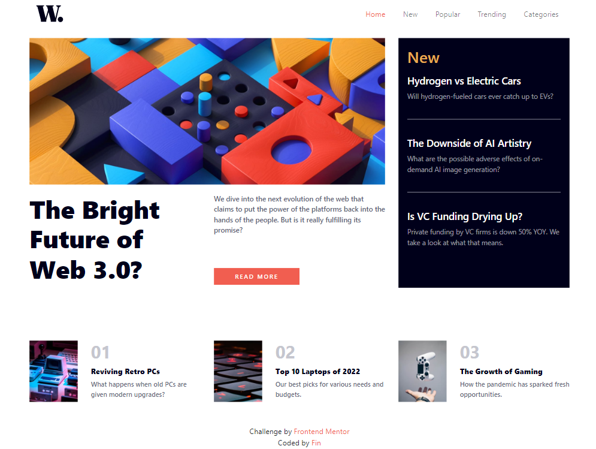
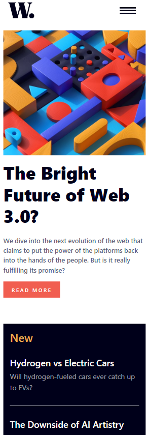
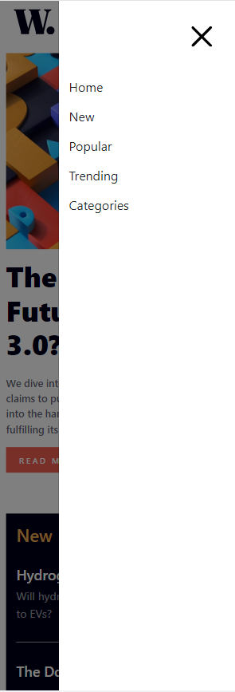

# Frontend Mentor - News Homepage solution

This is a solution to the [News homepage challenge on Frontend Mentor](https://www.frontendmentor.io/challenges/news-homepage-H6SWTa1MFl).

## Table of contents

- [Overview](#overview)
  - [Screenshots](#screenshots)
  - [Links](#links)
- [My process](#my-process)
  - [Built with](#built-with)
  - [What I learned](#what-i-learned)
  - [Continued development](#continued-development)
  - [Useful resources](#useful-resources)
- [Author](#author)

## Overview

### Screenshots

### Links

- Solution URL: [GitHub Repo](https://github.com/tdtatum2/News-Homepage)
- Live Site URL: [GitHub Pages](https://tdtatum2.github.io/News-Homepage)

## My process

### Built with

- Semantic HTML5 markup
- CSS custom properties
- Flexbox
- Mobile-first workflow
- [React](https://reactjs.org/) - JS library
- [ReactBootstrap](https://react-bootstrap.github.io/) - Styling library built for React

### What I learned

I learned a lot about utilizing rows and columns to create responsive designs with ease. It was the easiest time I've ever had going from mobile to desktop designs because it was as simple as changing the amount of columns that an element takes up. It was also my first experience with ReactBootstrap's Offcanvas component, as well as dynamically rendering images using HTML5's Picture element with srcSet!

### Continued development

- I want to learn what other useful HTML5 elements I am missing out on using.
- I want to apply my learnings of this responsive grid layout to my future projects.
- I want to learn more about complex element placement and alignment practices.

### Useful resources

- [My Custom CSS Reset](https://www.joshwcomeau.com/css/custom-css-reset/) - A useful CSS Reset template by Josh W Comeau recommended to me by Kamlesh Rajesh Yadav in a comment on my first ever Frontend Mentor post!

## Author

- Website - [Fin](https://www.fintatum.com)
- Frontend Mentor - [@tdtatum2](https://www.frontendmentor.io/profile/tdtatum2)